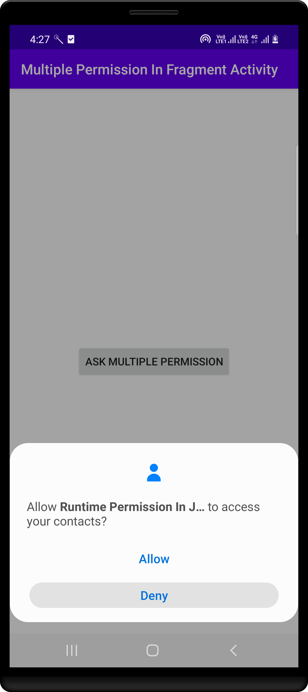
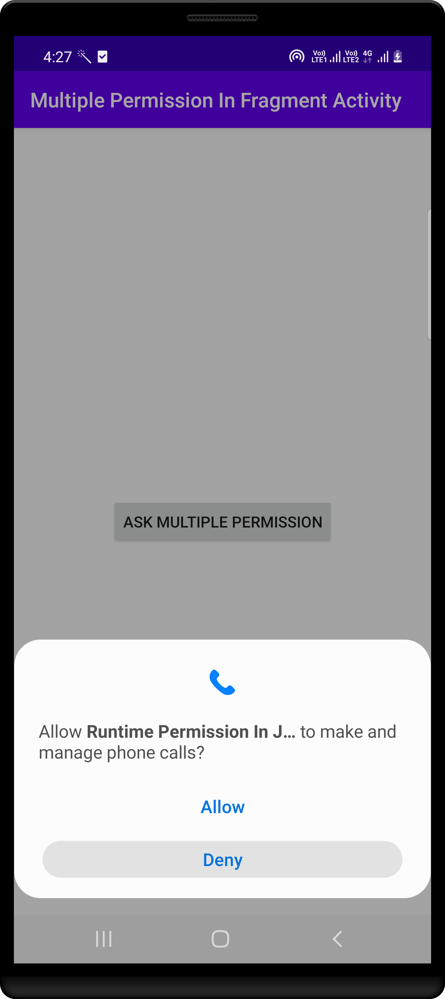

# JAVA - RuntimePermissionInJava #

Let RuntimePermissionInJava support

- Single Permission
- Multiple Permission
- With Custom UI
- Example with Fragment and Activity

|                   1               |                 2                 |                 3                 |                  4               |
|-----------------------------------|-----------------------------------|-----------------------------------|----------------------------------|
|  |  |  | |

|                  5                |                 6                 |                 7                 |                8                 |
|-----------------------------------|-----------------------------------|-----------------------------------|----------------------------------|
|  |  |  | |

|                  9                |
|-----------------------------------|
|  |

## Author ##

Rohit Yadav

[rohitnotes24@gmail.com](mailto:rohitnotes24@gmail.com)

[http://badasoftware.com/](http://badasoftware.com/)
